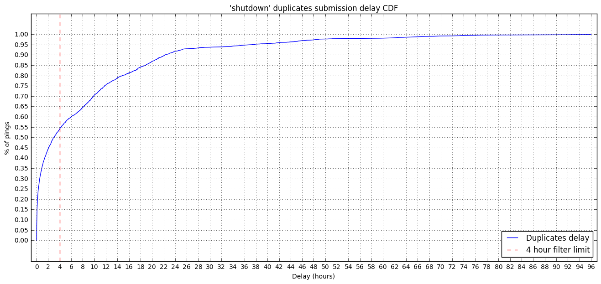
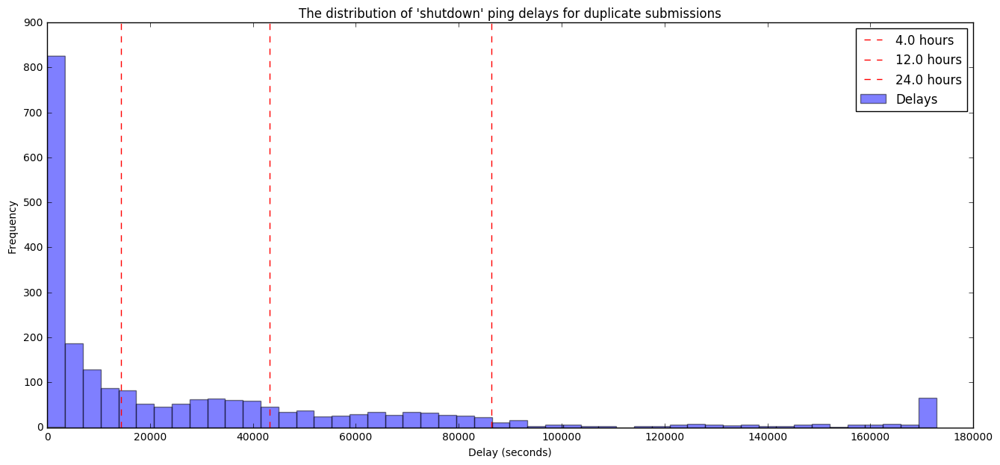

### Main Ping Submission Delay (Beta Channel) - pingSender

This analysis is an update of [the one](https://github.com/mozilla/mozilla-reports/blob/master/projects/main_ping_delays_pingsender.kp/knowledge.md) performed in the Nightly channel to validate the effectiveness of the pingsender to reduce data latency.

Specifically, this one investigates the difference between typical values of "recording delay" and "submission delay" between the previous Beta build and the latest one. The latter includes the [pingSender that started sending "shutdown" pings](https://bugzilla.mozilla.org/show_bug.cgi?id=1356673).


```python
import ujson as json
import matplotlib.pyplot as plt
import pandas as pd
import numpy as np
import plotly.plotly as py
import IPython

from datetime import datetime, timedelta
from email.utils import parsedate_tz, mktime_tz, formatdate

from plotly.graph_objs import *
from moztelemetry import get_pings_properties, get_one_ping_per_client
from moztelemetry.dataset import Dataset

%matplotlib inline
IPython.core.pylabtools.figsize(16, 7)
```
    Unable to parse whitelist: /mnt/anaconda2/lib/python2.7/site-packages/moztelemetry/histogram-whitelists.json.
    Assuming all histograms are acceptable.


We'll be looking at two cohorts: May 31 - June 7 (Beta 54) and June 14 - 20 (Beta 55). The `pingsender` started sending `shudown` pings in Beta 55.

We will examing two cohorts: the first with `shutdown` pings sent without the `pingsender`, the second with `shutdown` pings sent with the `pingsender`.


```python
pre_pings = Dataset.from_source("telemetry") \
    .where(docType="main") \
    .where(appUpdateChannel="beta") \
    .where(submissionDate=lambda x: "20170531" <= x < "20170607") \
    .where(appBuildId=lambda x: "20170420" <= x < "20170611") \
    .records(sc, sample=1)

post_pings = Dataset.from_source("telemetry") \
    .where(docType="main") \
    .where(appUpdateChannel="beta") \
    .where(submissionDate=lambda x: "20170614" <= x < "20170620") \
    .where(appBuildId=lambda x: "20170612" <= x < "20170622") \
    .records(sc, sample=1)
```
    fetching 1147169.41811MB in 39626 files...
    fetching 20894.21218MB in 8408 files...


To look at delays, we need to look at times. There are a lot of times, and they are recorded relative to different clocks.

**`meta/creationTimestamp`** The time the Telemetry code in Firefox created the ping, according to the client's clock, in nanoseconds since the epoch.

**`meta/Date`** - The time the Telemetry code in Firefox sent the ping to the server, according to the client's clock, expressed as a Date string conforming to [RFC 7231](https://tools.ietf.org/html/rfc7231#section-7.1.1.1).

**`meta/Timestamp`** - The time the ping was received by the server, according to the server's
clock, expressed in nanoseconds since the epoch.


```python
pre_subset = get_pings_properties(pre_pings, ["application/channel",
                                              "id",
                                              "meta/creationTimestamp",
                                              "meta/Date",
                                              "meta/Timestamp",
                                              "meta/X-PingSender-Version",
                                              "payload/info/reason",
                                              "payload/simpleMeasurements/shutdownDuration"])

post_subset = get_pings_properties(post_pings, ["application/channel",
                                                "id",
                                                "meta/creationTimestamp",
                                                "meta/Date",
                                                "meta/Timestamp",
                                                "meta/X-PingSender-Version",
                                                "payload/info/reason",
                                                "payload/simpleMeasurements/shutdownDuration"])
```
The `shutdown` ping is a particular kind of `main` ping with the `reason` field set to `shutdown`, as it's saved during shutdown.


```python
pre_subset = pre_subset.filter(lambda p: p.get("payload/info/reason") == "shutdown")
post_subset = post_subset.filter(lambda p: p.get("payload/info/reason") == "shutdown")
```
The rest of the analysis is cleaner if we combine the two cohorts here.


```python
def add_pre(p):
    p['pre'] = 'pre'
    return p

def add_post(p):
    p['pre'] = 'post'
    return p

combined = pre_subset.map(add_pre).union(post_subset.map(add_post))
```
Quick normalization: ditch any ping that doesn't have a creationTimestamp or Timestamp:


```python
prev_count = combined.count()
combined = combined.filter(lambda p:\
                       p["meta/Timestamp"] is not None\
                       and p["meta/creationTimestamp"] is not None)
filtered_count = combined.count()
print "Filtered {} of {} pings ({:.2f}%)"\
    .format(prev_count - filtered_count, prev_count, 100.0 * (prev_count - filtered_count) / prev_count)
```
    Filtered 0 of 34682752 pings (0.00%)


##### Deduplication
We sometimes receive main pings more than once (identical document ids). This is usually low, but let's check if this is still true after using the pingsender.

So we'll dedupe here.


```python
def dedupe(pings):
    return pings\
            .map(lambda p: (p["id"], p))\
            .reduceByKey(lambda a, b: a if a["meta/Timestamp"] < b["meta/Timestamp"] else b)\
            .map(lambda pair: pair[1])

combined_deduped = dedupe(combined)
```

```python
combined_count = combined.count()
combined_deduped_count = combined_deduped.count()
print "Filtered {} of {} shutdown pings ({:.2f}%)"\
    .format(combined_count - combined_deduped_count, combined_count,
            100.0 * (combined_count - combined_deduped_count) / combined_count)
```
    Filtered 481634 of 34682752 shutdown pings (1.39%)


This is slightly higher than our Nightly [analysis](https://github.com/mozilla/mozilla-reports/blob/master/projects/main_ping_delays_pingsender.kp/knowledge.md#submission-delay), which reported 1.07%, but still in the expected range of about 1%.


```python
MAX_DELAY_S = 60 * 60 * 96.0
HOUR_IN_S = 60 * 60.0
PRES = ['pre', 'post']
```

```python
def setup_plot(title, max_x, area_border_x=0.1, area_border_y=0.1):
    plt.title(title)
    plt.xlabel("Delay (hours)")
    plt.ylabel("% of pings")

    plt.xticks(range(0, int(max_x) + 1, 2))
    plt.yticks(map(lambda y: y / 20.0, range(0, 21, 1)))

    plt.ylim(0.0 - area_border_y, 1.0 + area_border_y)
    plt.xlim(0.0 - area_border_x, max_x + area_border_x)

    plt.grid(True)

def plot_cdf(data):
    sortd = np.sort(data)
    ys = np.arange(len(sortd))/float(len(sortd))

    plt.plot(sortd, ys)
```

```python
def calculate_submission_delay(p):
    created = datetime.fromtimestamp(p["meta/creationTimestamp"] / 1000.0 / 1000.0 / 1000.0)
    received = datetime.fromtimestamp(p["meta/Timestamp"] / 1000.0 / 1000.0 / 1000.0)
    sent = datetime.fromtimestamp(mktime_tz(parsedate_tz(p["meta/Date"]))) if p["meta/Date"] is not None else received
    clock_skew = received - sent
    
    return (received - created - clock_skew).total_seconds()
```

```python
delays_by_chan = combined_deduped.map(lambda p: (p["pre"], calculate_submission_delay(p)))
```
### Submission Delay

**Submission Delay** is the delay between the data being recorded on the client and it being received by our infrastructure. It is thought to be dominated by the length of time Firefox isn't open on a client's computer, though retransmission attempts and throttling can also contribute.


```python
setup_plot("'shutdown' ping submission delay CDF", MAX_DELAY_S / HOUR_IN_S, area_border_x=1.0)

for pre in PRES:
    plot_cdf(delays_by_chan\
             .filter(lambda d: d[0] == pre)\
             .map(lambda d: d[1] / HOUR_IN_S if d[1] < MAX_DELAY_S else MAX_DELAY_S / HOUR_IN_S)\
             .collect())
    
plt.legend(["No pingsender", "With pingsender"], loc="lower right")
```


    <matplotlib.legend.Legend at 0x7fda065b6f10>


The use of `pingsender` results in an improvement in the submission delay of the `shutdown` "main" ping:

- we receive more than 85% of the mentioned pings **within the first hour**, instead of about ~25% without the pingsender;
- ~95% of the `shutdown` pings within 8 hours, compared to ~95% received after over 90 hours without it.  

We don't receive 100% of the pings sooner for builds having the `pingsender` enabled because the `pingsender` can fail submitting the ping (e.g. the system or Firefox uses a proxy, poor connection, ...) and, when this happen, no retrasmission is attempted; the ping will be sent on the next restart by Firefox.

## How many duplicates come from the pingsender?
Let's start by separating the pings coming from the `pingsender` from the ones coming from the normal Firefox flow since the `pingsender` started sending the `shutdown` pings. 


```python
post_pingsender_only = post_subset.filter(lambda p: p.get("meta/X-PingSender-Version") is not None)
post_no_pingsender = post_subset.filter(lambda p: p.get("meta/X-PingSender-Version") is None)
```

```python
num_from_pingsender = post_pingsender_only.count()
num_no_pingsender = post_no_pingsender.count()
total_post = post_subset.count()
num_sent_by_both =\
    post_pingsender_only.map(lambda p: p["id"]).intersection(post_no_pingsender.map(lambda p: p["id"])).count()
```
We want to understand how many pings were sent by the pingsender, correctly received from the server, and sent again next time Firefox starts.


```python
def pct(a, b):
    return 100 * float(a) / b

print("Duplicate pings percentage: {:.2f}%".format(pct(num_sent_by_both, total_post)))
```
    Duplicate pings percentage: 0.41%


Do we get many more duplicates after landing the `shutdown pingsender`?


```python
count_deduped_pre = dedupe(pre_subset).count()
count_pre = pre_subset.count()
count_deduped_post = dedupe(post_subset).count()
count_post = post_subset.count()

print("Duplicates with shutdown pingsender:\nBefore:\t{:.2f}%\nAfter:\t{:.2f}%\n"\
      .format(pct(count_pre - count_deduped_pre, count_pre),
              pct(count_post - count_deduped_post, count_post)))
```
    Duplicates with shutdown pingsender:
    Before:	1.40%
    After:	0.85%
    


It looks like 1% of the pings sent by the `pingsender` are also being sent by Firefox next time it restarts. This is potentially due to `pingsender`:

- being terminated after sending the ping but before successfully deleting the ping from the disk;
- failing to remove the ping from the disk after sending it;
- receiving an error code from the server even when the ping was successfully sent.

It's important to note that the percentages of duplicate pings from the previous cells are not the same. The first, 0.41%, is the percentage of duplicates that were sent at least once by pingsender whereas the last, 0.85%, includes all duplicates regardless of whether pingsender was involved. This looks way better than the numbers in the Nightly channel possibly due to disabling the pingsender when the OS is shutting down, which happened in bug 1372202 (after the Nightly analysis was performed).

## What's the delay between duplicate submissions?
Start off by getting the pings that were sent by both the `pingsender` and the normal Firefox flow. This is basically mimicking an `intersectByKey`, which is not available on pySpark.


```python
pingsender_dupes = post_pingsender_only\
    .map(lambda p: (p["id"], calculate_submission_delay(p)))\
    .cogroup(post_no_pingsender\
           .map(lambda p: (p["id"], calculate_submission_delay(p))))\
    .filter(lambda p: p[1][0] and p[1][1])\
    .map(lambda p: (p[0], (list(p[1][0]), list(p[1][1]))))
```
The `pingsender_dupes` RDD should now contain only the data for the pings sent by both systems. Each entry is in the form:

`{ping-id: ([ delays for duplicates from the pingsender ], [delays for duplicates by FF])}`

We assume that the `pingsender` only sends a ping once and that Firefox might attempt to send more than once, hence might have more than one ping delay in its list. Let's see if these claims hold true.


```python
# Number of duplicates, for each duped ping, from the pingsender.
print pingsender_dupes.map(lambda p: len(p[1][0])).countByValue()
# Number of duplicates, for each duped ping, from Firefox.
print pingsender_dupes.map(lambda p: len(p[1][1])).countByValue()
```
    defaultdict(<type 'int'>, {1: 2295})
    defaultdict(<type 'int'>, {1: 2243, 2: 38, 3: 10, 4: 3, 6: 1})


Unlike the data from the Nightly channel, we see no proof that the `pingsender` can send the same ping ping more than once. On Nightly it had a very low occurrence, while on Beta it isn't happening at all in the current data. We still can see some duplicates coming from Firefox, with the occurrence being a little higher.

Finally, compute the average delay between the duplicates from the `pingsender` and Firefox.


```python
delay_between_duplicates =\
    pingsender_dupes.map(lambda t: np.fabs(np.max(t[1][1]) - np.min(t[1][0])))
```

```python
setup_plot("'shutdown' duplicates submission delay CDF", MAX_DELAY_S / HOUR_IN_S, area_border_x=1.0)

plot_cdf(delay_between_duplicates\
         .map(lambda d: d / HOUR_IN_S if d < MAX_DELAY_S else MAX_DELAY_S / HOUR_IN_S)\
         .collect())
plt.axvline(x=4, ymin=0.0, ymax = 1.0, linewidth=1, linestyle='dashed', color='r')
plt.legend(["Duplicates delay", "4 hour filter limit"], loc="lower right")
```


    <matplotlib.legend.Legend at 0x7fda04742ad0>





About ~55% of the duplicates can be caught by the pipeline ping deduplicator because they will arrive within a 4 hour window.


```python
collected_delays = delay_between_duplicates.collect()
```

```python
plt.title("The distribution of 'shutdown' ping delays for duplicate submissions")
plt.xlabel("Delay (seconds)")
plt.ylabel("Frequency")

# Use 50 bins for values up to the clip value, and accumulate the
# rest in the last bucket (instead of having a super-long tail).
plt.hist(np.clip(collected_delays, 0, 48.0 * HOUR_IN_S),
         alpha=0.5, bins=50, label="Delays")
# Plot some convenience marker for 4, 12 and 24 hours.
for m in [4.0, 12.0, 24.0]:
    plt.axvline(x=m * HOUR_IN_S, ymin=0.0, ymax = 1.0, linewidth=1, linestyle='dashed', color='r',
                label="{} hours".format(m))
plt.legend()
```


    <matplotlib.legend.Legend at 0x7fda07e1f3d0>





## Did we regress shutdownDuration?
The `shutdownDuration` is [defined](https://gecko.readthedocs.io/en/latest/toolkit/components/telemetry/telemetry/data/main-ping.html#shutdownduration) as the time it takes to complete the Firefox shutdown process, in milliseconds. Extract the data from the two series: before the shutdown pingsender was enabled and after. Plot the data as two distinct distributions on the same plot.


```python
pre_shutdown_durations = pre_subset.map(lambda p: p.get("payload/simpleMeasurements/shutdownDuration", None))\
                                   .filter(lambda p: p is not None)\
                                   .collect()
post_shutdown_durations = post_subset.map(lambda p: p.get("payload/simpleMeasurements/shutdownDuration", None))\
                                     .filter(lambda p: p is not None)\
                                     .collect()
```

```python
plt.title("'shutdown' pingsender effect on the shutdown duration")
plt.xlabel("shutdownDuration (milliseconds)")
plt.ylabel("Number of pings")

# Use 50 bins for values up to the clip value, and accumulate the
# rest in the last bucket (instead of having a super-long tail).
CLIP_VALUE = 10000 # 10s
plt.hist([np.clip(pre_shutdown_durations, 0, CLIP_VALUE), np.clip(post_shutdown_durations, 0, CLIP_VALUE)],
         alpha=0.5, bins=50, label=["No pingsender", "With pingsender"])
plt.gca().set_yscale("log", nonposy='clip')
plt.legend()
```


    <matplotlib.legend.Legend at 0x7fda047687d0>


It seems that the distribution of shutdown durations for builds with the pingsender enabled has a different shape compared to the distribution of shutdown durations for builds with no pingsender. The former seems to be a bit shifted toward higher values of the duration times. The same trend can be spotted on [TMO](https://mzl.la/2sFSQVB).

Let's dig more into this by looking at some statistics about the durations.


```python
def stats(data, label):
    print("\n{}\n".format(label))
    print("Min:\t{}".format(np.min(data)))
    print("Max:\t{}".format(np.max(data)))
    print("Average:\t{}".format(np.mean(data)))
    print("50, 90 and 99 percentiles:\t{}\n".format(np.percentile(data, [0.5, 0.9, 0.99])))

stats(pre_shutdown_durations, "No pingsender (ms)")
stats(post_shutdown_durations, "With pingsender (ms)")
```
    
    No pingsender (ms)
    
    Min:	4
    Max:	3706649472
    Average:	10254.4014656
    50, 90 and 99 percentiles:	[ 373.  399.  403.]
    
    
    With pingsender (ms)
    
    Min:	12
    Max:	127666866
    Average:	5622.89186625
    50, 90 and 99 percentiles:	[ 375.  406.  411.]
    


It seems that builds that are sending `shutdown` pings at shutdown are taking up to about 8ms more to close.


```python

```
